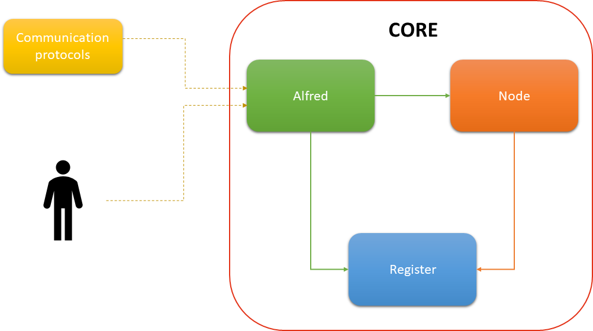

# Library Design

This section is focused on the Java library. When other platforms become available the differences between the platforms will be higlighted.

The Uniquid Library is divided in three components:

* **Alfred**
* **Node**
* **Register**

Below is reported a graphic schema that illustrate the library's logical areas.

## Alfred

Like a good butler, Alfred takes care of accessing and communicating various protocols \(MQTT, HTTP, etc...\) with the library.  
 Alfred offers the ProviderCore interface for message exchange with library and additional functionality management.  
 Before making a request, it verifies that the sender has permission to do so. It allows you to instantiate:

* Request and Response interfaces
* Additional functionality management interfaces

ProviderRequest provides methods for a request. Similarly, ProviderResponse provides methods for responding to a received request.

## Register

The Register is the component that deals with device data management and persistence.  
 It is independant of the type of storage you choose \(SQLite, text files, etc...\).  
 It provides several interfaces for handling and persistence of data.  

* RegisterFactory
* ProviderRegister
* UserRegister
* TransactionManager

It also provide 2 beans:

* ProviderChannel
* UserChannel

## Node

Node is the interface from the library that implements the SPV Node handling key creation and usage, communication with the blockchain, and all the features of Wallet SPV.  
 This interface provide the layers with the Wallet library chosen by the user \(BitcoinJ, BitcoinSPV, etc...\). It has an UniquidNode interface for managing Wallet features, from communicating with the Blockchain to receiving contracts.  
 The UniquidNode also offers a callback mechanism \(UniquidNodeEventListener\) to notify changes in the user/provider contracts, whether they are created or revoked.  
 To get information about a contract, there are the ProviderChannel and UserChannel classes that provide the methods that you need.

The Node is identified by a state:

* Created
* Imprinting
* Ready

